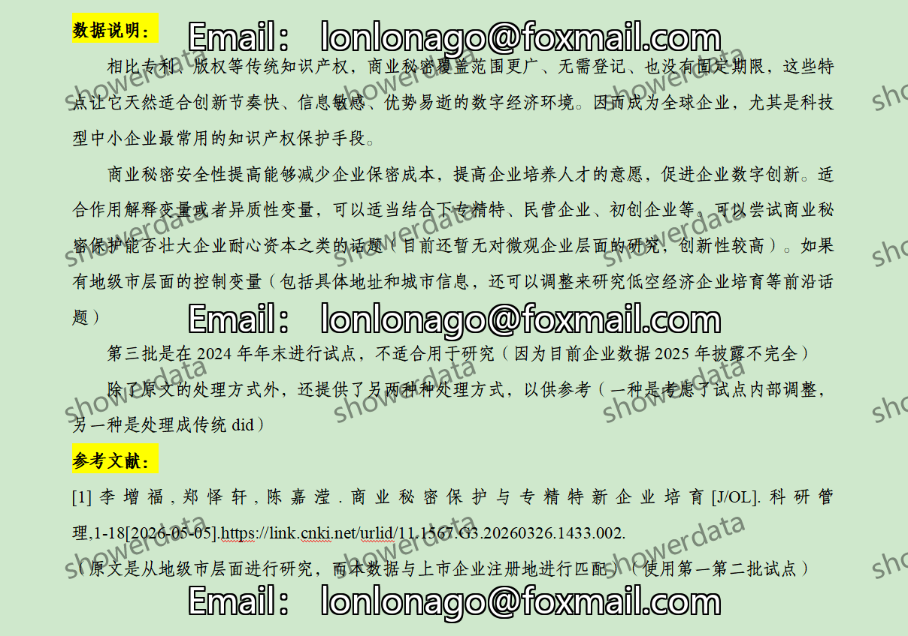
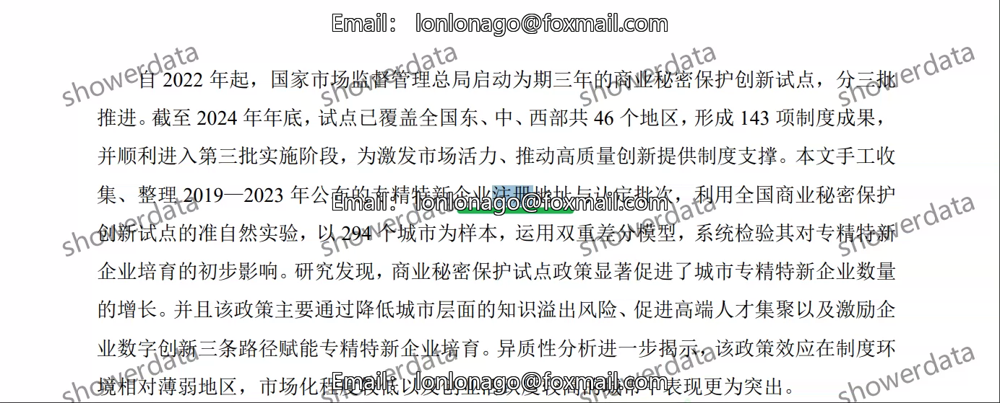
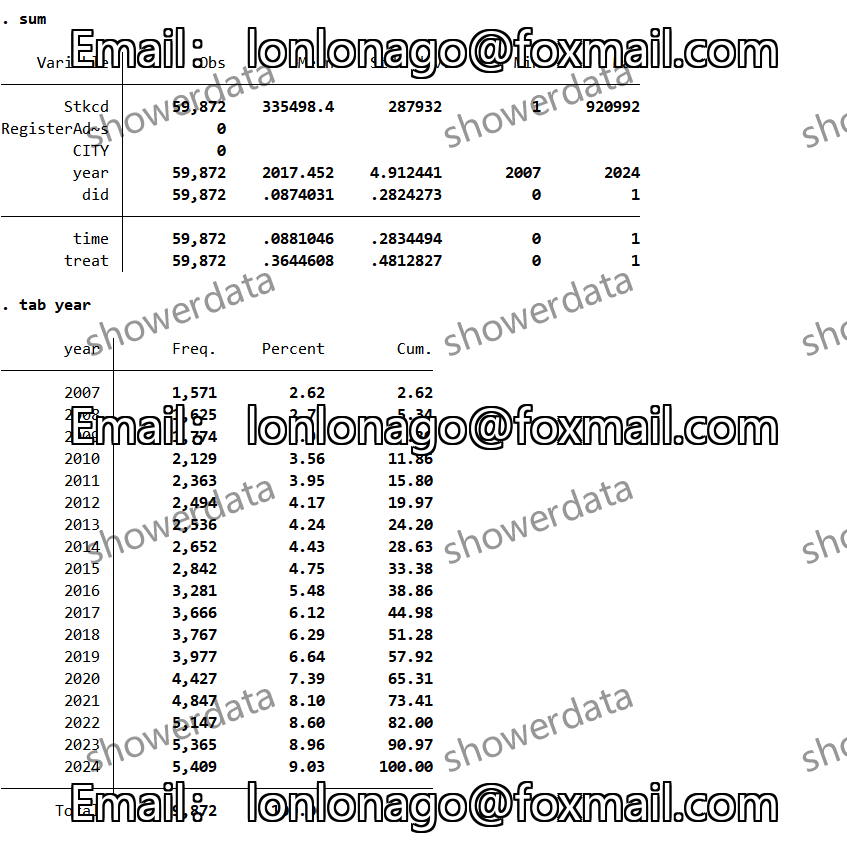
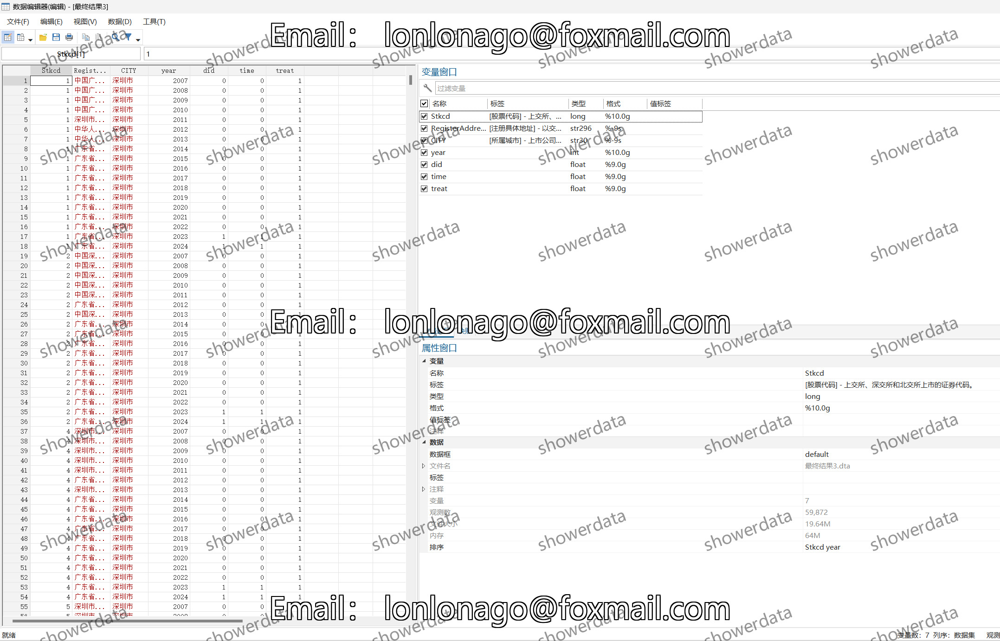
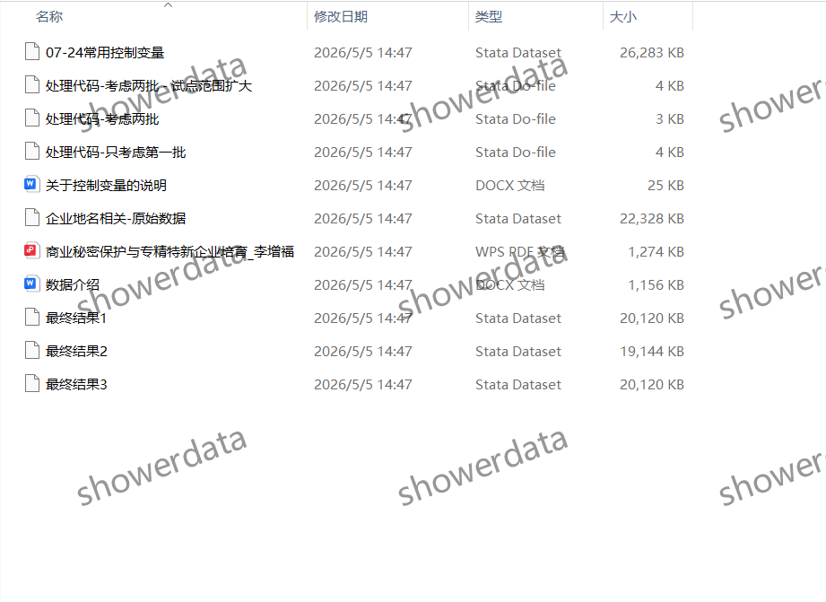

## Body

# 上市公司-商业秘密保护DID数据

## 一、数据介绍

### (1) 数据详情：
请在拍下前仔细阅读下方图片，确保您已完全了解数据内容。本数据已完整展示说明，请您确认是否确实需要再进行购买。发货后，任何理由的退款或更换请求将不被接受。请在购买前确认自己会使用此数据，不提供答疑服务，感谢您的理解与支持！数据中可能存在由客观原因导致的缺失值，介意者请勿购买，谢谢您的配合！

### (2) 数据名称：
上市公司-商业秘密保护DID数据

### (3) 样本范围：
A股上市公司

### (4) 时间范围：
2007-2024年

### (5) 结果数据格式：
Excel、Dta

### (6) 数据内容：
原始数据、代码、最终结果、参考文献

## 二、数据结果指标如图所示

## 三、指标构造方法如图所示

## 四、参考文献如图所示

## Images

item_1051946844679

Here is a pay link on Stripe ( https://buy.stripe.com/3cs8yP7sY87d0vu9AB ). Please contact me lonlonago@foxmail.com after funding $89, and I will send you a complete data files , thank you!

